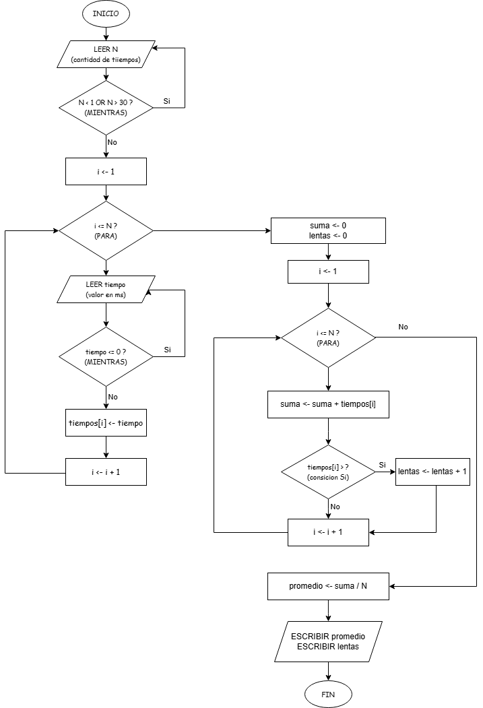

# Evaluación Semana 2 - Algoritmos

## Descripción del caso
Una empresa de desarrollo de software necesita supervisar el rendimiento de una API para verificar que sus tiempos de respuesta sean adecuados. El algoritmo comienza solicitando al usuario la cantidad de tiempos de respuesta que desea registrar (N), verificando que el valor esté entre 1 y 30. Posteriormente, se ingresan los tiempos de respuesta en milisegundos y cada dato se valida para asegurar que sea mayor que cero; si el valor es inválido, el sistema solicita capturarlo nuevamente. Los tiempos válidos se almacenan en un arreglo para su posterior procesamiento. Una vez completada la captura, el algoritmo recorre el arreglo para calcular la suma total de los tiempos, obtener el tiempo promedio de respuesta y contar cuántas solicitudes superaron los 200 milisegundos, ya que estas se consideran respuestas lentas. Finalmente, muestra al usuario el promedio obtenido y la cantidad de respuestas lentas registradas.

---

## Pseudocódigo

```text
ALGORITMO TiemposRespuestaAPI
VARIABLES
    N       : ENTERO
    tiempos : ARREGLO[30] DE REAL
    tiempo  : REAL
    suma    : REAL
    promedio: REAL
    lentas  : ENTERO
    i       : ENTERO

INICIO
    ESCRIBIR "¿Cuántos tiempos desea ingresar? (Máximo 30): "
    LEER N
    MIENTRAS N < 1 OR N > 30 HACER
        ESCRIBIR "Cantidad inválida. Debe estar entre 1 y 30."
        LEER N
    FIN_MIENTRAS

    PARA i DE 1 HASTA N CON PASO 1 HACER
        ESCRIBIR "Ingrese el tiempo de respuesta ", i, " (ms): "
        LEER tiempo
        MIENTRAS tiempo <= 0 HACER
            ESCRIBIR "Valor inválido. Debe ser mayor que 0."
            ESCRIBIR "Ingrese nuevamente el tiempo: "
            LEER tiempo
        FIN_MIENTRAS
        tiempos[i] ← tiempo
    FIN_PARA

    suma ← 0
    lentas ← 0

    PARA i DE 1 HASTA N CON PASO 1 HACER
        suma ← suma + tiempos[i]
        SI tiempos[i] > 200 ENTONCES
            lentas ← lentas + 1
        FIN_SI
    FIN_PARA

    promedio ← suma / N
    ESCRIBIR "Tiempo promedio: ", promedio, " ms"
    ESCRIBIR "Cantidad de respuestas lentas: ", lentas
FIN
```

---

## Diagrama de flujo


---

## Tabla de trazado

**Datos de prueba**

- N = 5
- Tiempos ingresados: **150, 300, 180, 250, 120**

| Evento | i | tiempo | tiempos[i] | suma | lentas | promedio |
|--------|---:|--------:|-----------:|------:|--------:|----------:|
| Inicio | - | - | - | - | - | - |
| PARA i=1, LEER tiempo | 1 | 150 | 150 | - | - | - |
| PARA i=2, LEER tiempo | 2 | 300 | 300 | - | - | - |
| PARA i=3, LEER tiempo | 3 | 180 | 180 | - | - | - |
| PARA i=4, LEER tiempo | 4 | 250 | 250 | - | - | - |
| PARA i=5, LEER tiempo | 5 | 120 | 120 | - | - | - |
| Inicialización de acumuladores | - | - | - | 0 | 0 | - |
| Procesamiento i=1 | 1 | - | 150 | 0 → 150 | 0 | - |
| Procesamiento i=2 | 2 | - | 300 | 150 → 450 | 1 | - |
| Procesamiento i=3 | 3 | - | 180 | 450 → 630 | 1 | - |
| Procesamiento i=4 | 4 | - | 250 | 630 → 880 | 2 | - |
| Procesamiento i=5 | 5 | - | 120 | 880 → 1000 | 2 | - |
| Cálculo del promedio | - | - | - | 1000 | 2 | 1000 / 5 = 200 |
| **Resultados finales** | **-** | **-** | **-** | **1000** | **2** | **200 ms** |

**Resultados obtenidos**

- Suma total: **1000 ms**
- Tiempo promedio: **200 ms**
- Respuestas lentas mayores a 200 ms: **2**
